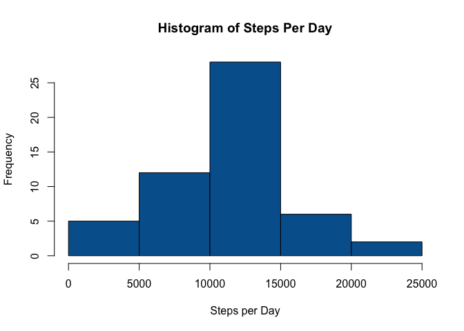
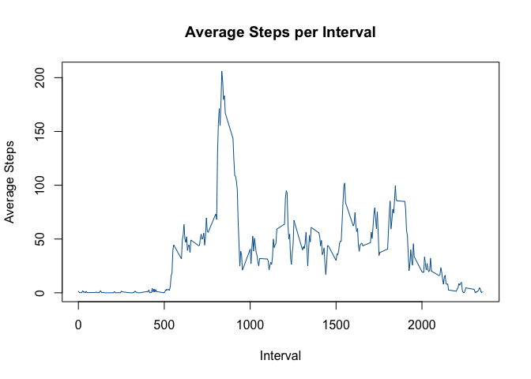
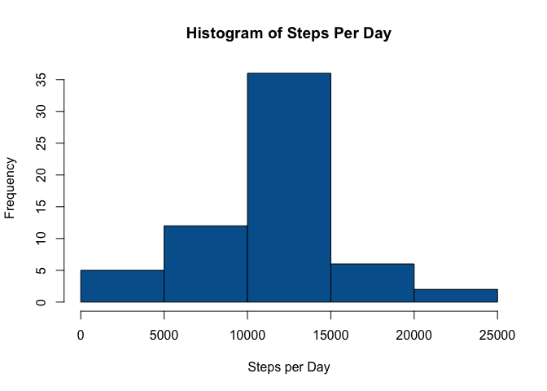
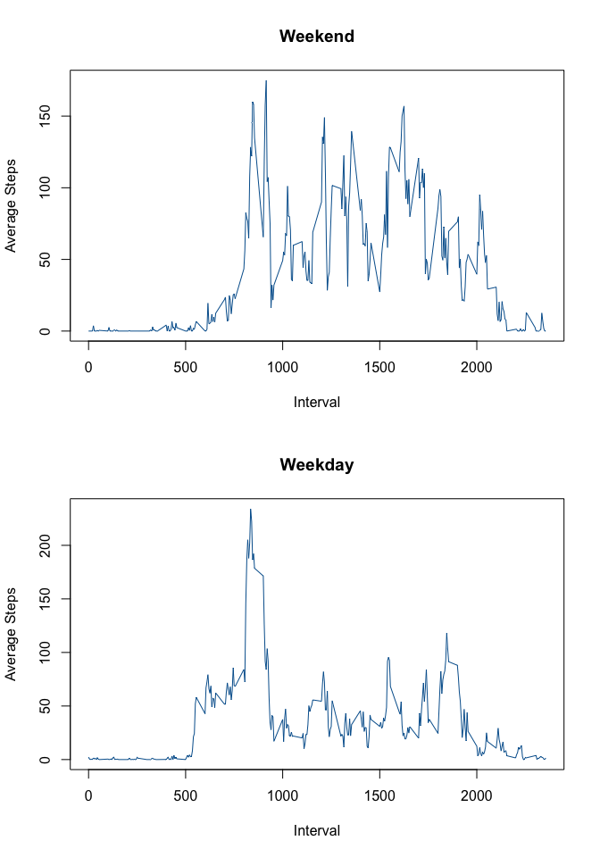

# Reproducible Research: Peer Assessment 1


## Loading and preprocessing the data
1. Loading the data and including the dplyr package, which will be useful later on.
2. Minimal processing needed as file is imported with column names and classes

```r
library(dplyr)
data<-read.csv("activity.csv",header=T,colClasses=c("integer","Date","integer"))
```


## What is mean total number of steps taken per day?  
1. Calculating the number of steps per day is easy with dplyr - just a group_by and summarize.  
2. Draw the histogram  

```r
daily<-summarize(group_by(data,date),sum(steps))
colnames(daily)<-c("Date","Steps")
hist(daily$Steps,main="Histogram of Steps Per Day",xlab="Steps per Day",col=rgb(0,96,156,max=255))
```

 

3. Calculate mean and median.  

```r
mea<-format(mean(daily$Steps,na.rm=T),scientific=F,big.mark=",")
med<-format(median(daily$Steps,na.rm=T),big.mark=",")
```

Mean: 10,766.19  
Median: 10,765  

## What is the average daily activity pattern?  
1. Plot average steps at each interval. Data obtained using same method as before, but grouping by interval instead of date.  


```r
interval<-summarize(group_by(data,interval),mean.steps=mean(steps,na.rm=T))
plot(interval$interval,interval$mean.steps,main="Average Steps per Interval",xlab="Interval",col=rgb(0,96,156,max=255),ylab="Average Steps",type="l")
```

 

2. Calculate the max step interval and how many steps are at that interval.


```r
max.steps<-max(interval$mean.steps)
max.interval<-interval[interval$mean.steps==max.steps,1]
```

Max Interval: 835  
Steps at that Interval: 206.2


## Imputing missing values  
1. Calculate number of missing values

```r
nrow(data[is.na(data$steps),])
```

```
[1] 2304
```

2. Strategy: I am using the method of replacing `NA` values with the mean for that interval.  
3. Fill in missing values and plot histogram

```r
joined<-merge(data,interval)
joined <- joined %>% mutate(steps = ifelse(is.na(steps),round(mean.steps,0),steps))
daily<-summarize(group_by(joined,date),sum(steps))
colnames(daily)<-c("Date","Steps")
hist(daily$Steps,main="Histogram of Steps Per Day",xlab="Steps per Day",col=rgb(0,96,156,max=255))
```

 

4. Calculate mean and median for imputed data. 


```r
mea<-format(mean(daily$Steps,na.rm=T),scientific=F,big.mark=",")
med<-format(median(daily$Steps,na.rm=T),big.mark=",")
```
Mean: 10,765.64  
Median: 10,762  

Oops, looks like a lot of those `NA` values were at times of the day when there was low activity, so the mean and median dropped a little.  

## Are there differences in activity patterns between weekdays and weekends?  
1. Add the factor variable for weekdays and weekends

```r
joined<-cbind(data,weekday=ifelse(weekdays(data$date)=="Saturday" | weekdays(data$date)=="Sunday","Weekend","Weekday"))
```

2. Make a panel plot containing a time series plot (i.e. type = "l") of the 5-minute interval (x-axis) and the average number of steps taken, averaged across all weekday days or weekend days (y-axis). See the README file in the GitHub repository to see an example of what this plot should look like using simulated data.


```r
# Group the data by interval and split by weekday and weekend
interval<-summarize(group_by(joined,interval,weekday),mean.steps=mean(steps,na.rm=T))
x<-interval[interval$weekday=="Weekend",c(1,3)]
y<-interval[interval$weekday=="Weekday",c(1,3)]
# Draw the plots
par(mfcol=c(2,1))
plot(x,main="Weekend",xlab="Interval",col=rgb(0,96,156,max=255),ylab="Average Steps",type="l")
plot(y,main="Weekday",xlab="Interval",col=rgb(0,96,156,max=255),ylab="Average Steps",type="l")
```

 
